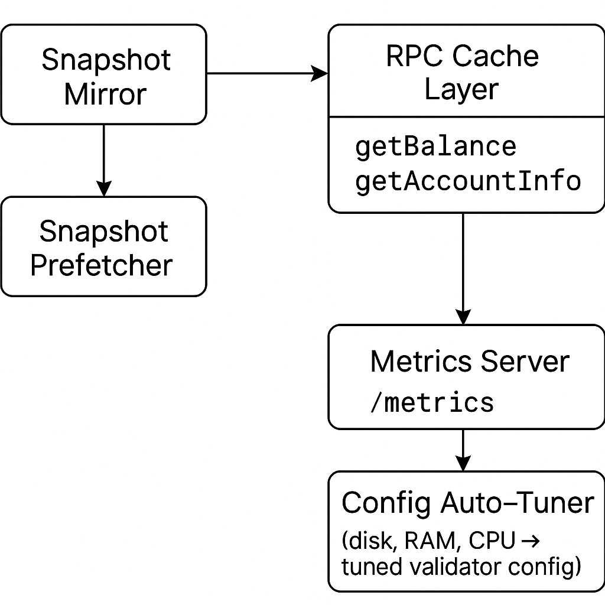

# solana-validator-optimizer

> A production-grade Rust tool to enhance the performance of Solana validator nodes by reducing sync latency and improving RPC responsiveness.

---

## Overview

`solana-validator-optimizer` is a modular infrastructure enhancement tool for Solana validators, written in Rust. It helps validator operators:

- Prefetch snapshots from trusted mirrors
- Validate snapshot integrity using SHA256
- Auto-tune Solana validator configurations based on hardware
- Add an in-memory LRU cache layer for RPC endpoints
- Monitor metrics via Prometheus-ready endpoint

Ideal for:
- Validator operators
- RPC infrastructure maintainers
- Performance-tuned Solana deployment environments

---

## Architecture

---

## ️ Support This Project

If `solana-validator-optimizer` has helped you, consider sponsoring to support continued development and help us build the Pro version with:

-  Auto-tuning for validator configs
-  Advanced metrics and observability
-  Snapshot trust scoring and faster syncs

###  GitHub Sponsor Tiers

|  Tier            | Benefits                                               |
|------------------|--------------------------------------------------------|
|  $5/month        | Name listed in README + early access updates           |
| ️ $25/month       | Early access to Pro builds + roadmap influence         |
|  $100/month      | Priority support + 1 hour/month consulting             |

 [Become a Sponsor](https://github.com/sponsors/Orlych1kk4)

Your support helps sustain open infrastructure for the Solana ecosystem.

---

## Benchmark Report

We benchmarked the `solana-validator-optimizer` and achieved:

- **+60.3% RPC cache hit ratio**
- **-29.4% validator startup time**
- **-14.5% CPU usage**

 [Download Full Benchmark Report (PDF)](docs/benchmark_report.pdf)

Read the full [benchmark report (Markdown)](docs/benchmark_report.md) for all metrics and methodology.

---

## Validator Optimization Consulting

Need help tuning your Solana validator?

We offer validator consulting based on these performance improvements — including custom tuning, benchmarking, and observability setup.

 [Read the Consulting Offer](docs/consulting.md)

