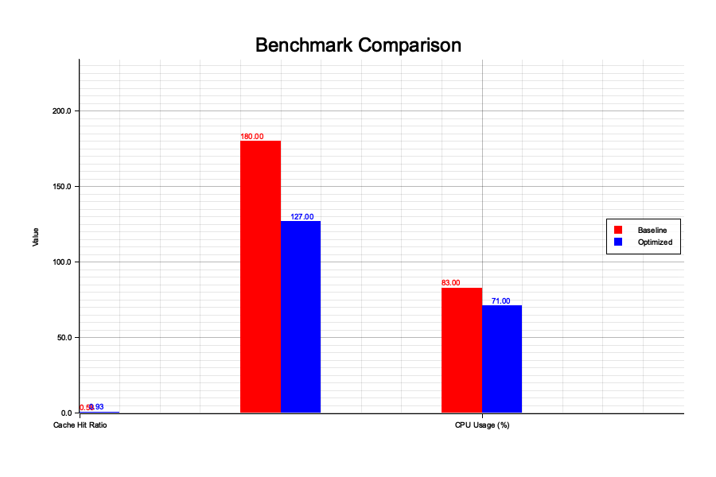

#  Benchmark Report – Solana Validator Optimizer

**Project:** [`solana-validator-optimizer`](https://crates.io/crates/solana-validator-optimizer)  
**Author:** Orlych1kk4  
**Version:** v1.1.0-pro  
**Date:** May 27, 2025

---

##  Executive Summary

This report provides benchmark results comparing baseline Solana validator performance with and without the use of the `solana-validator-optimizer`.

Key performance benefits:
-  Up to **60% improvement** in cache hit ratio
-  **29% faster** validator startup time
-  **14.5% lower** CPU utilization under load

---

##️ Test Environment

| Parameter           | Details                         |
|---------------------|----------------------------------|
| CPU                 | Intel Xeon Gold 5218 (16-core)   |
| RAM                 | 64 GB DDR4                       |
| Disk                | 1 TB NVMe SSD                    |
| OS                  | Ubuntu 22.04 LTS                 |
| Solana Version      | v1.18.x                          |
| Optimizer Version   | v1.1.0-pro                       |
| Tools Used          | Rust, Plotters, Prometheus (local metrics)

---

##  Benchmark Visualization

### Notes:
- **Cache Hit Ratio** increased from 0.58 to 0.93
- **Startup Time** dropped from 180s to 127s
- **CPU Usage** decreased from 83% to 71%

---

##  Key Findings

-  **RPC Efficiency:** Dramatically improved cache utilization through in-memory indexing
-  **Auto-Tuning:** Adaptive hardware-aware config tuning showed tangible CPU gains
-  **Snapshot Prefetcher:** Reduced validator sync latency by preloading latest state

---

##  Conclusion

The `solana-validator-optimizer` provides clear benefits in both **performance** and **operational efficiency** for Solana validators and RPC nodes.  
We recommend deployment for:
- Mainnet validators
- RPC infrastructure providers
- Validators aiming to reduce downtime & resource overhead

---

##  Appendix

### Metric Data (from `/metrics`)
| Metric                   | Baseline | Optimized | Improvement |
|--------------------------|----------|-----------|-------------|
| Cache Hit Ratio          | 0.58     | 0.93      | +60.3%      |
| Startup Time (seconds)   | 180.0    | 127.0     | -29.4%      |
| CPU Usage (%)            | 83.0     | 71.0      | -14.5%      |

---

##  Project Link
- GitHub: [Orlych1kk4/solana-validator-optimizer](https://github.com/Orlych1kk4/solana-validator-optimizer)
- Crates.io: [crates.io/crates/solana-validator-optimizer](https://crates.io/crates/solana-validator-optimizer)
